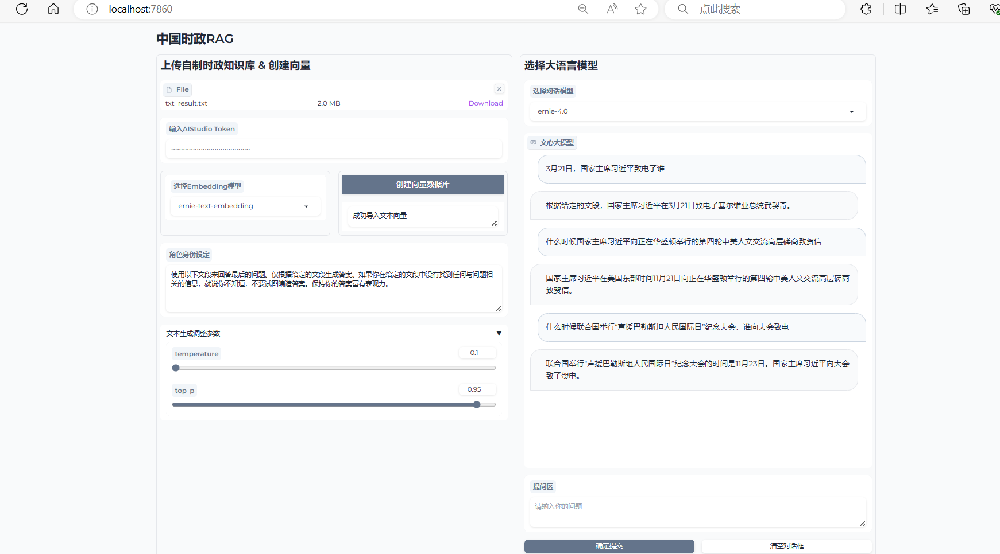

## 项目架构
```text
Statistical-modeling
    - attack_module                 # 对抗训练模块
        - attack.py
    - datasets
        - origin_data               # 原始数据
        - seq_data                  # 序列标注数据
        - span_data                 # span标注数据
    - losses
        - mcc_loss.py               # mcc损失函数
    - metrices
        - sequence_label_metric.py  # 序列标注评估指标
        - span_metric.py            # span标注评估指标
    - models
        - crf.py                    # crf模块
        - sequence_label_model.py   # 序列标注模型
        - span_model.py             # span标注模型
    - output                        # 模型输出，日志等
    - processors
        - base_processor.py         # Bert数据处理基类
        - convert_raw_data.py       # 原始数据处理类
        - data_processor.py         # 数据处理工具类
        - global_processor.py       # GlobalPointer数据处理类
        - processor.py              # 数据处理基类
        - vocab.py                  # 词汇类
    - scripts # 运行脚本
        - bert-softmax.sh           # 序列标注: bert + softmax模型
        - bert-crf.sh               # 序列标注: bert + crf模型
        - bert-lstm-crf.sh          # 序列标注: bert + lstm + crf模型
        - bert-span.sh              # span标注: bert + span模型
        - bert-globalpointer.sh     # span标注: bert + globalpointer模型
        - run_all_scripts.sh        # 运行所有脚本
    - utils
        - get_entity.py             # 序列转span类
        - options.py                # 参数类
        - trainer.py                # 优化器、调度器类
        - util.py                   # 工具类
    - run.py                        # 主程序运行类
    - train_val_test_step.py        # 训练类
    - app.gradio.py                 # RAG知识库在线问答运行类
    - db.py                         # RAG知识库数据库类
    - common.py                     # 嵌入向量类
```

## 运行环境：

```text
python 3.8
pytorch 1.10
transformers 4.39.3
```

## 运行脚本
一键运行所有脚本
```text
bash ./scripts/run_all_scripts.sh
``
```

序列标注
```text
bash ./scripts/bert-softmax.sh
bash ./scripts/bert-crf.sh
bash ./scripts/bert-lstm-crf.sh
```
span标注
```
bash ./scripts/bert-span.sh
bash ./scripts/bert-globalpointer.sh
```

## RAG知识库在线问答
```text
python app.gradio.py
```
访问端口号：http://localhost:7860/

1. 导入时政语料，将其转换为RAG知识库
2. 填入token后，在线调用百度大模型进行问答
3. 点击submit按钮，即可进行在线问答。

